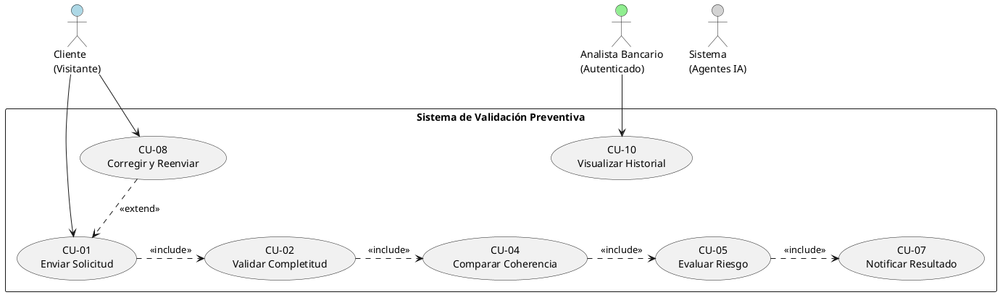

# Sistema Inteligente de Validación y Análisis Preventivo para Onboarding

Este repositorio contiene el código fuente para la Prueba de Concepto (PoC) de un Sistema Inteligente de Validación y Análisis Preventivo para Onboarding para el Banco Andino, como parte del "Proyecto Hito 1 - Hagamos una iniciativa de Gen AI".

## Descripción del Proyecto

Este es un sistema diseñado para optimizar el proceso de onboarding de nuevos clientes bancarios. Utiliza un enfoque de **validación preventiva** mediante tres agentes de IA especializados para analizar las solicitudes en tiempo real, proporcionando una respuesta en aproximadamente 5 segundos.

### Agentes de IA
1.  **Agente de Completitud**: Verifica que todos los campos y documentos requeridos estén presentes.
2.  **Agente de Coherencia**: Usa OCR y un Large Language Model (LLM) para comparar los datos del formulario con los documentos adjuntos.
3.  **Agente de Riesgo**: Realiza una evaluación preliminar para detectar Personas Expuestas Políticamente (PEP) y otras actividades de riesgo.

## Stack Tecnológico

-   **Frontend**: React 18+, TypeScript, React Hook Form, Yup, TailwindCSS.
-   **Backend**: Node.js 18+, Express.
-   **Infraestructura (Planificada)**: AWS (API Gateway, Lambda/EC2, DynamoDB, S3, Cognito).
-   **LLMs (Planificados)**: OpenAI GPT-4 y Anthropic Claude 3.

## Estructura del Repositorio

```
├── backend/         # Código del servidor Node.js (Express)
├── frontend/        # Aplicación cliente (React)
├── .gitignore       # Archivos y carpetas ignorados por Git
├── PARTE_II...md    # Documento de especificación de requerimientos
├── RESUMEN_...md    # Resumen de implementación
└── README.md        # Este archivo
```

## Cómo Ejecutar el Frontend

Actualmente, solo el componente de formulario del frontend está implementado (TASK-001).

1.  **Navegar a la carpeta del frontend:**
    ```bash
    cd frontend
    ```

2.  **Instalar dependencias:**
    ```bash
    npm install
    ```

3.  **Iniciar el servidor de desarrollo:**
    ```bash
    npm start
    ```

La aplicación estará disponible en `http://localhost:3000`.

---

## Diagrama de Casos de Uso

El siguiente diagrama ilustra las interacciones principales entre los actores (Cliente, Analista) y el sistema.



## Modelo de Datos (DynamoDB)

El sistema utiliza tres tablas principales en DynamoDB para persistir la información de manera eficiente y escalable.

```mermaid
erDiagram
    SOLICITUD_ONBOARDING ||--o{ DOCUMENTO_ADJUNTO : "contiene"
    SOLICITUD_ONBOARDING ||--|| RESULTADO_VALIDACION : "tiene"

    SOLICITUD_ONBOARDING {
        string id PK "uuid"
        string numero_identificacion "GSI"
        string estado "GSI"
        string nombre_completo
        string email
        number ingresos_declarados
        boolean es_pep
        string fecha_creacion
    }

    DOCUMENTO_ADJUNTO {
        string solicitud_id PK "uuid"
        string id SK "uuid"
        string tipo_documento
        string url_archivo "S3 path"
        string estado_procesamiento
    }

    RESULTADO_VALIDACION {
        string solicitud_id PK "uuid"
        string decision_final
        map validacion_coherencia "Incoherencias"
        map evaluacion_riesgo "Nivel de riesgo"
        number tiempo_procesamiento_ms
    }
```

## Arquitectura de la Solución (AWS)

La solución está diseñada para ser serverless, escalable y resiliente, utilizando los siguientes servicios clave de AWS.

*(Para visualizar el diagrama, genera el archivo `arquitectura_validacion_aws.png` ejecutando el script de Python correspondiente y súbelo al repositorio).*

!Arquitectura AWS

## Próximos Pasos

-   **TASK-002**: Implementar el componente de carga de documentos.
-   **TASK-003**: Desarrollar el endpoint `POST /api/validar-solicitud` en el backend.
-   Integrar el frontend con el backend para el envío de solicitudes.
